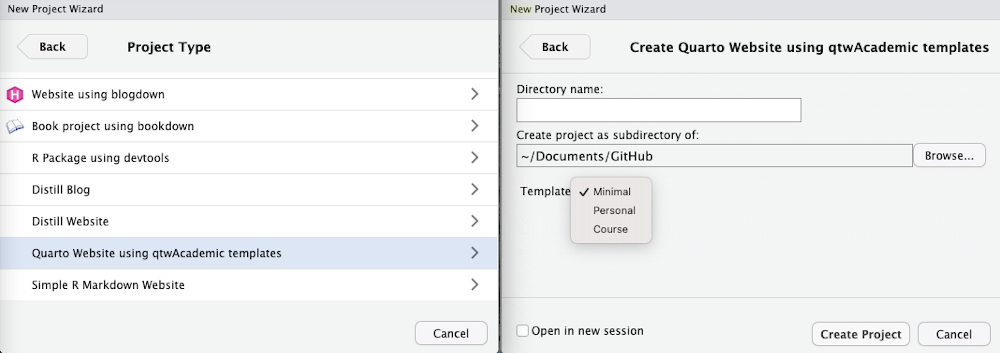

# qtwAcademic <a href="https://andreaczhang.github.io/qtwAcademic/"></a>


[qtwAcademic](https://andreaczhang.github.io/qtwAcademic/) stands for **Quarto Websites for Academics**, which
provides a few Quarto templates for Quarto website that are commonly used by academics. 

The templates are designed to make it quick and easy for users with little or no Quarto experience to create a website for their personal portfolio or courses. Each template is fully customisable once the user is more familiar with Quarto. 

More about Quarto can be read [here](https://quarto.org).

### Templates

- Personal website 

- Website for courses or workshops

- Minimal website template that can be easily customized

You can find more details on each option in the vignettes.


## Installation

`qtwAcademic` has not been submitted to CRAN yet. You can install the development version from github. 

```
devtools::install_github("andreaczhang/qtwAcademic")
```

`qtwAcademic` depends on `quarto`, so it is necessary to have the latest version.

```
install.packages("quarto")
```

## Usage 

After installation, you should be able to create an R project with the Rstudio project wizard.

In Rstudio,

1. File > New Project > New Directory

2. Scroll down and click **Create Quarto Website using qtwAcademic templates**

3. In the drop-down menu, select the template you prefer. 

</a>

This will generate a self-contained R project ready for render.


## Publishing

There are a few ways to publish your website. You can read more about publishing [here](https://quarto.org/docs/publishing/). 


