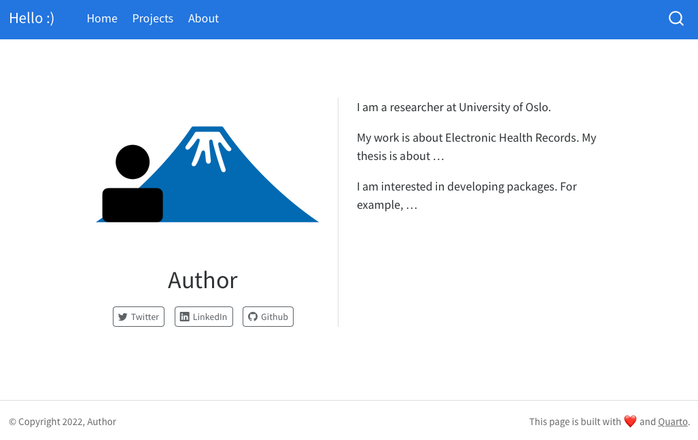
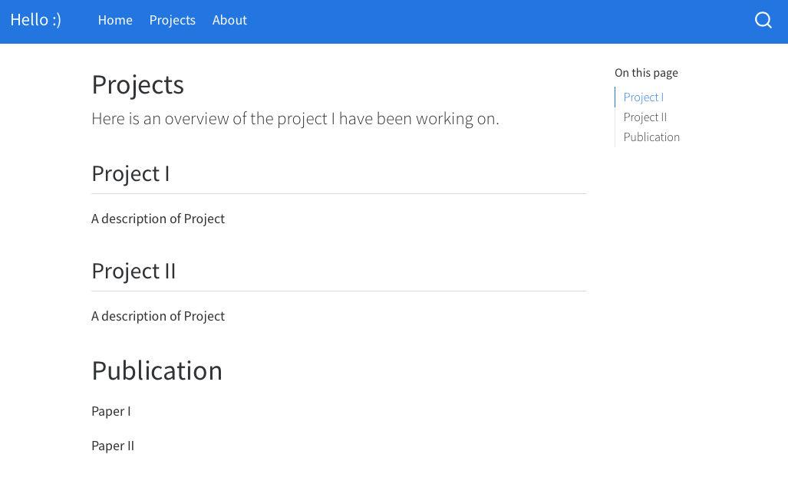

```{r setup, include = FALSE}
knitr::opts_chunk$set(
  collapse = TRUE,
  comment = "#>"
)
```


Creating and publishing a Quarto websites is not difficult; however, the flexibility and options Quarto provides can make it challenging for people who are new to Quarto and websites to get started. This package aims to make it quick and easy for users to create their own websites for **personal portfolio and/or course websites** as an R project.


### Templates

- **Personal** website 

- Website for **courses** or workshops

- **Minimal** website template that can be easily customized


# Example: Minimal template

Here we introduce the template with minimal content. When a project is created with `Minimal` template, the following content are added to the directory: 

* `_quarto.yml`: metadata for the website, controls the layout of the website
* `index.qmd` 
* `about.qmd`
* `profile.png`: profile figure
* `styles.css`: style file. It is left empty in the template, but can be modified for advanced looks.
* `projects/index.qmd`

Click **Render**, the website is generated and can be seen in the Viewer panel.


## Website structure

The homepage of the rendered website looks like this. 

</a>

The **navigation bar** is on the top of the page. 3 pages are included in the minimal template: **Home** (`index.qmd`), **Projects** (`projects/index.qmd`) and **About** (`about.qmd`). 

The layout is specified under `navbar` section of `_quarto.yml`, along with the title and footer of the website. More about Quarto website navigation can be read [here](https://quarto.org/docs/websites/website-navigation.html). 

```
website:
  page-navigation: true
  title: "Hello :)"

  page-footer:
    left: "&copy; Copyright 2022, Author"
    right: "This page is built with ❤️ and [Quarto](https://quarto.org/)."

  navbar:
    left:
      - href: index.qmd
        text: Home

      - href: projects/index.qmd
        text: Projects

      - href: about.qmd
        text: About
```
It is straightforward to understand where to find the relevant files in order to change the text. For example, 
**Home** contains one figure and some text about the author, which can be edited in `index.qmd`. 


## Projects

The **Projects** page is a standard Quarto markdown file. 

It is placed inside the project directory, however it is also ok to place it under the root directory, as long as the correct link is specified in `_quarto.yml`.

</a>


## Add new pages and content

1. create a new Quarto markdown file, such as `talks.qmd`. The easiest way to do that is to copy from project. 

2. specify where you want to place the new content in `_quarto.yml`. 


