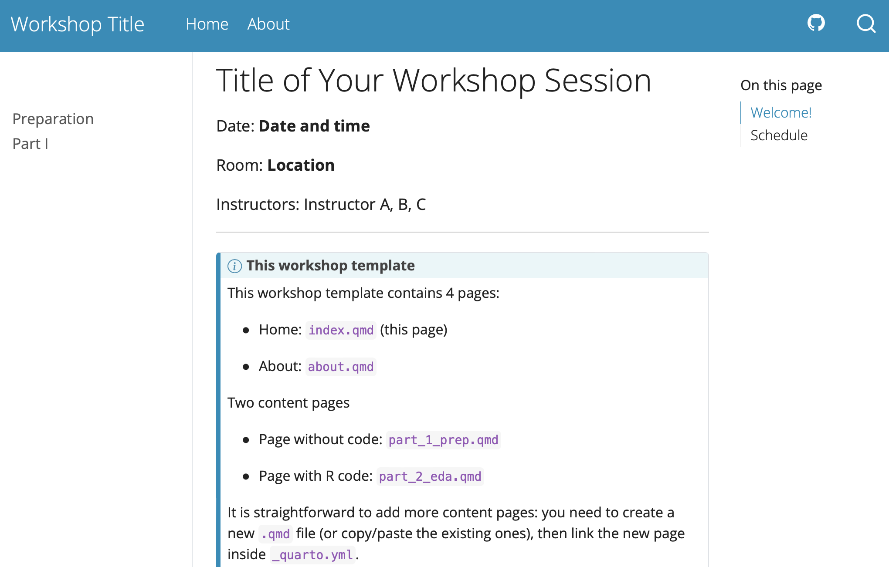
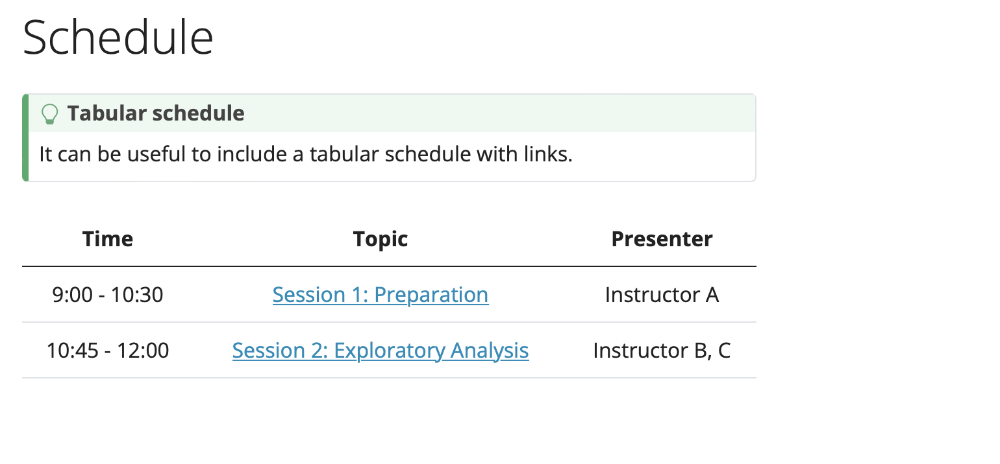
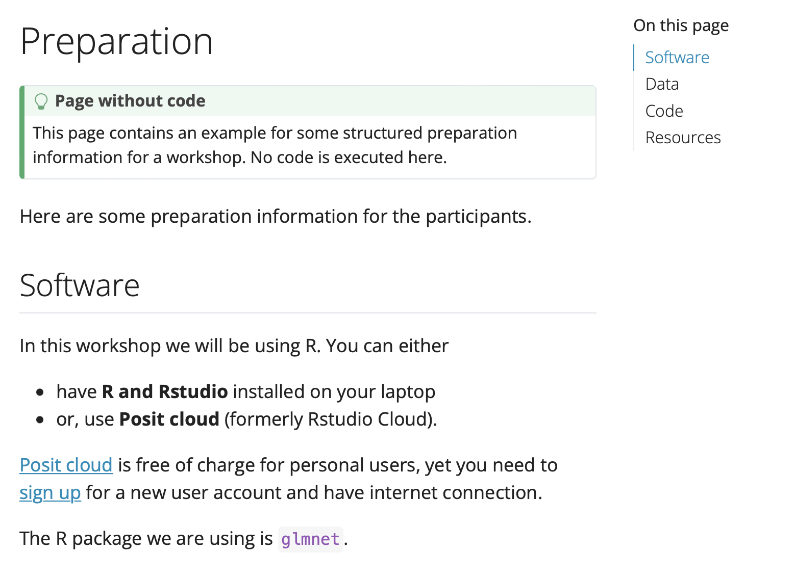
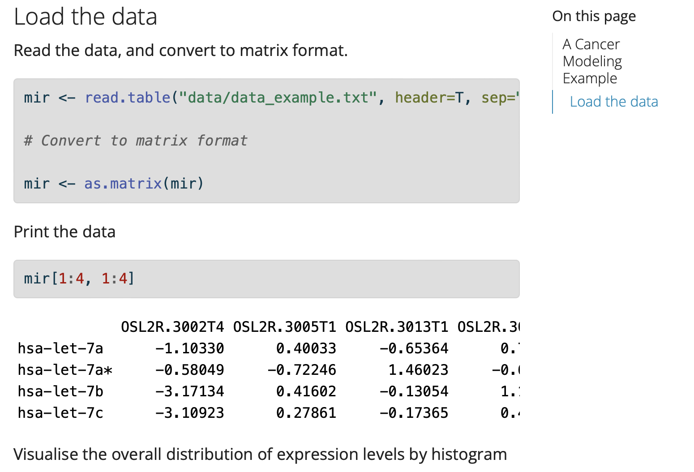

```{r setup, include = FALSE}
knitr::opts_chunk$set(
  collapse = TRUE,
  comment = "#>"
)
```


This template make it quick and easy to create a Quarto website for your courses and workshops.

By default, **sidebar navigation** is used here. This is particularly handy when the courses are organized by week or topics. If the user prefers, it is also convenient to edit `_quarto.yml` to switch to **top navigation**.

```
website:
  title: "Workshop Title"
  navbar:
    left:
      - href: index.qmd
        text: Home
      - href: about.qmd
        text: About
    right:
      - icon: github
        href: https://github.com
  sidebar:
    style: "docked"
    search: true
    contents:
      - part_1_prep.qmd
      - part_2_eda.qmd
  page-navigation: true

```

## Website structure

This template has provided some useful content for users to get started: 

- **Home page** with basic information for the course/workshop, along with a tabular schedule

- One example page without executable code

- One example page with executable code (where a folder with example dataset is provided for illustration)

- About page 

</a>

</a>

## Authoring and computation

Authoring with `qmd` is straightforward, especially for users with `R markdown` experience. To learn more about authoring and computation you can check [here](https://quarto.org/docs/authoring/markdown-basics.html).

This is how the plain text document looks like.
</a>


This is how the document with code chunks look like. 
</a>


