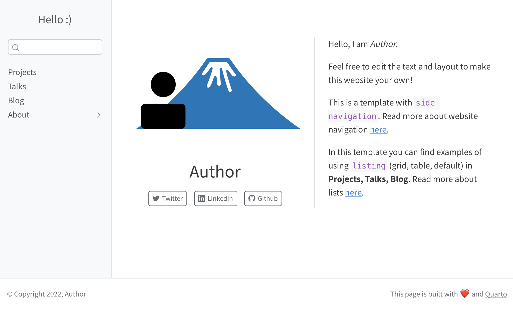
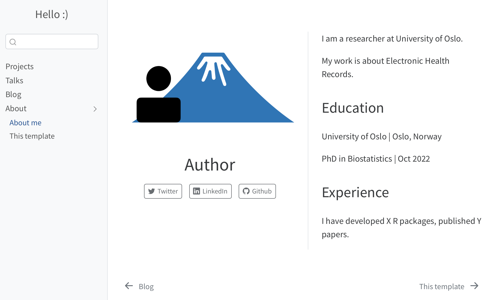
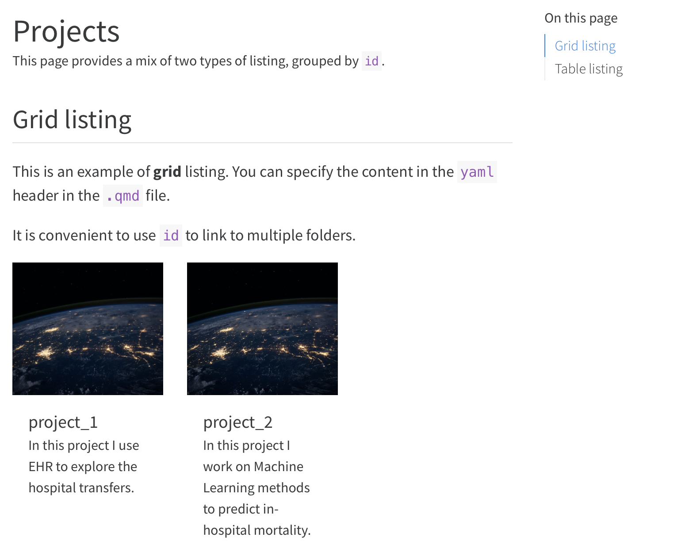
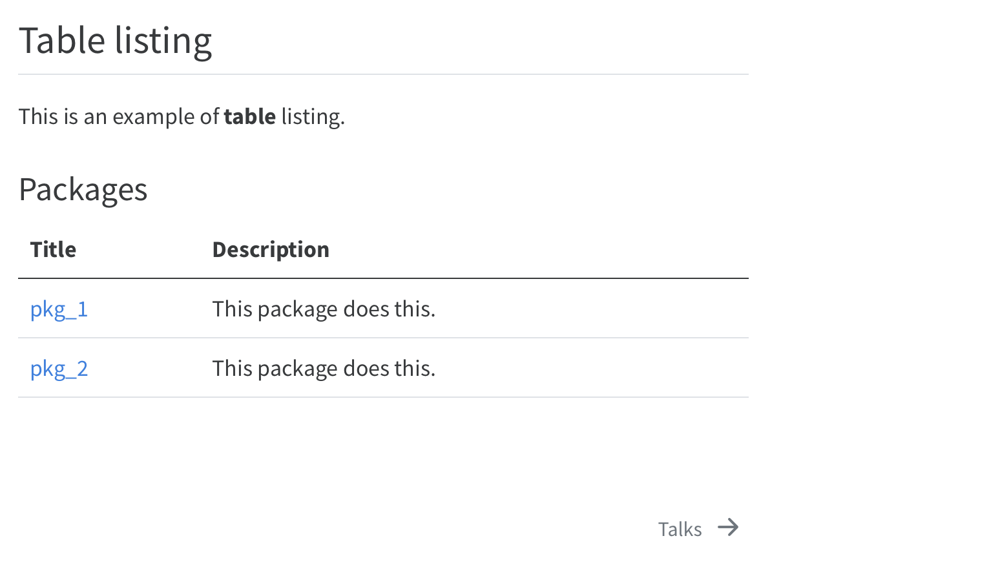
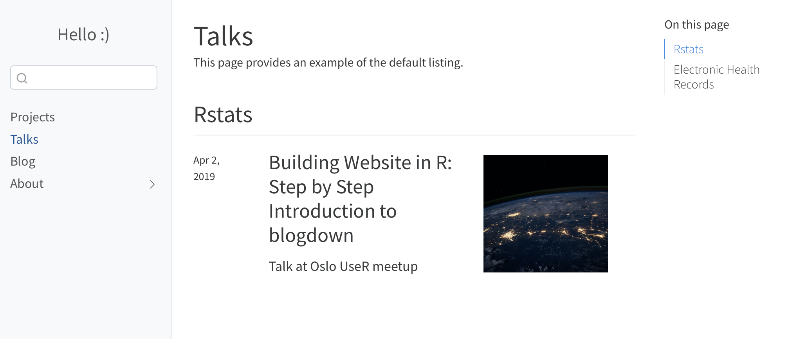

```{r setup, include = FALSE}
knitr::opts_chunk$set(
  collapse = TRUE,
  comment = "#>"
)
```


In this page you will find a slightly more complex personal website setup. This template is different from the `Minimal` template in the following ways: 

- Sidebar navigation

- The **About** section is collapsed (sub-menu)

- Listing is used to organize content in **Projects, Talks, Blog** sections

These modifications are particular useful when you have more content, and wish to present them in different ways.

## Navigation: side or top

Side navigation bar can be useful if you have more topics to display. This is the way to set up a sidebar in the `_quarto.yml`. 

```
  sidebar:
    pinned: true
    align: center
    style: "docked"
    collapse-level: 1
    contents:

      - text: "Projects"
        href: projects/index.qmd

      - text: "Talks"
        href: talks/index.qmd

      - text: "Blog"
        href: blog.qmd

      - section: "About"
        contents:
          - text: "About me"
            href: about.qmd
          - text: "This template"
            href: about_template.qmd
```


</a>


## Sub-menu 

When sub-sections under a topic is desired, you can put them in the sub-menu. 

In side navigation, it is specified by **section** and **contents** in the `_quarto.yml` file. 

</a>

In top navigation, it is specified by **menu**.

```
  navbar:
    left:
      - text: "About"
        menu:
          - about.qmd
          - about_template.qmd 
```

## Page listing

Compared to the Minimal template, **Projects** page contains more complex structures: page listing makes it possible to organize topics in various layouts. This can be achieved by editing the `yaml` header in `projects/index.qmd`. 

Under `contents`, provide the folder where your projects are stored; then specify `type` (grid, table or default).

```
listing:
  - id: ehr
    max-description-length: 500
    image-height: 150px
    fields: [image, title, description]
    contents: 
      - project_1
      - project_2
    type: grid
    grid-item-border: false
  - id: packages
    max-description-length: 80
    image-height: 250px
    fields: [title, description]
    contents: 
      - pkg_1
      - pkg_2
    type: table
    grid-item-border: false
    sort-ui: false
    filter-ui: false
```
</a>

After the `yaml` header, edit the markdown text and reference the listing using the `id`:
```
It is convenient to use `id` to link to multiple folders. 

::: {#ehr}
:::
```
</a>

This is how `type: default` looks like. 

</a>

More information on page listing can be read [here](https://quarto.org/docs/websites/website-listings.html).

